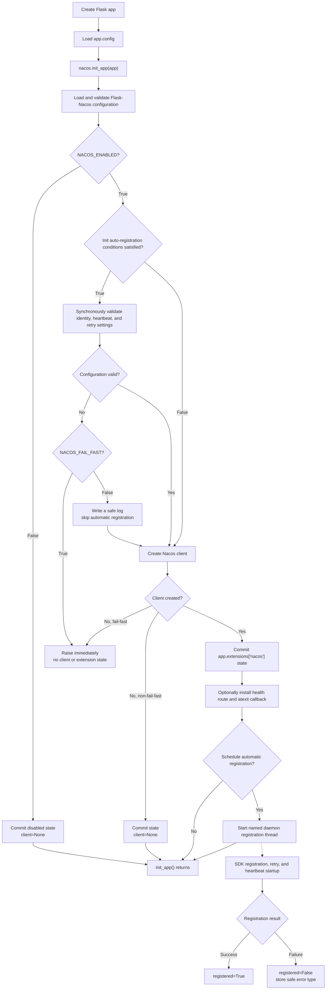
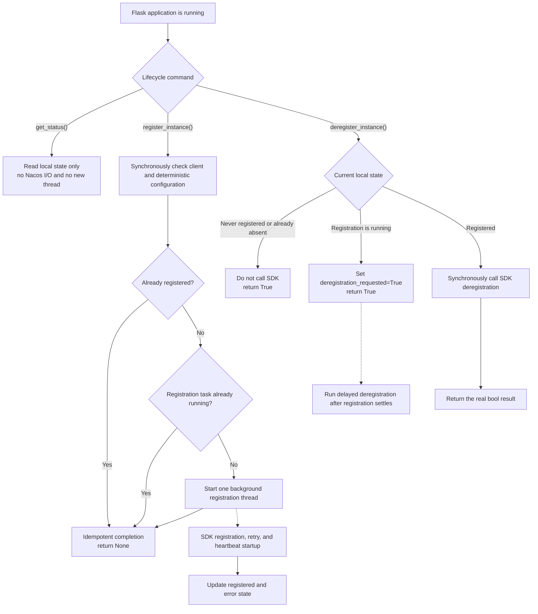

# Service Registration

English | [简体中文](service-registration.zh-CN.md)

How flask-nacos registers and deregisters service instances.

See also: [Configuration](configuration.md) - [API Reference](api-reference.md) -
[Production](production.md).

## Automatic registration

When `NACOS_REGISTER_ENABLED`, `NACOS_AUTO_REGISTER`, and
`NACOS_AUTO_REGISTER_ON_INIT` are all `True`, `init_app(app)` schedules the
service registration background task. Registration settings are validated
synchronously before the SDK client is created or extension state is installed. With
`NACOS_FAIL_FAST=True`, invalid settings raise immediately; otherwise the error
is logged and automatic registration is skipped while config center and
discovery remain usable.

All three registration switches default to `True`; automatic registration still
requires a valid service name and port.

If any of the three switches is off, registration settings are not required at
startup. They are validated if `register_instance()` is called manually.

## Explicit registration

`NACOS_REGISTER_ENABLED` only controls init-time automatic registration. It
does not disable an explicit manual call.

```python
nacos.register_instance()
```

## Non-blocking on-demand registration

`register_instance()` is a no-argument lifecycle command for readiness hooks,
post-worker initialization, Flask/Celery shared factories, and other lifecycle
entry points. It always returns `None` immediately and runs registration in a
daemon thread.

```python
app.config["NACOS_AUTO_REGISTER_ON_INIT"] = False
nacos.register_instance()
status = nacos.get_status()
```

Inspect `registered`, `registration_in_progress`, and
`last_registration_error_type` to observe the background result.

## Registration lifecycle flow

### Application initialization



### Runtime registration and deregistration



Registration and deregistration races use last-explicit-operation-wins
semantics. `get_status()` is the query side of the command/query lifecycle and
never performs SDK I/O.

## Registration parameters

Validated before registration; invalid values follow `NACOS_FAIL_FAST`:

- `NACOS_SERVICE_NAME` - required, a non-empty, non-whitespace string.
- `NACOS_SERVICE_PORT` - required, integer in `1-65535`.
- `NACOS_SERVICE_WEIGHT` - finite number greater than `0`.
- `NACOS_SERVICE_METADATA` - a `dict`.
- `NACOS_SERVICE_EPHEMERAL` - a `bool`.
- `NACOS_SERVICE_HEARTBEAT_INTERVAL` - finite number greater than `0` (seconds).

## Ephemeral instance heartbeat

Ephemeral instances rely on SDK heartbeats to stay healthy. Flask-Nacos passes
`NACOS_SERVICE_HEARTBEAT_INTERVAL` to SDK 2.x when registering an ephemeral
instance; the default is `5.0` seconds. Setting the initial `healthy=True` only
describes registration state and cannot replace heartbeat renewal.

Persistent instances do not receive a heartbeat interval. If an ephemeral
instance first has zero healthy instances and then disappears, check heartbeat
logs, `NACOS_SERVICE_EPHEMERAL`, namespace/group consistency, and whether the
Flask process is still alive. `/health/nacos` reports local client initialization
state and does not prove that Nacos continues to receive heartbeats.

## IP auto-detection

If `NACOS_SERVICE_IP` is unset, the extension attempts to detect the local
outbound IP. If detection fails, behavior follows `NACOS_FAIL_FAST`.

Production recommendation: configure `NACOS_SERVICE_IP` explicitly. In
containers, multi-NIC hosts, or behind NAT the auto-detected address may not be
reachable by other services. Also set `NACOS_SERVICE_NAME` and
`NACOS_SERVICE_PORT` explicitly.

## Idempotent single-flight registration

Registration is always per-app, per-process, single-flight, and idempotent after
success. When a worker is forked (the process id changes), inherited local state
is reset and the child may register its own instance.

## Multi-process registration (Gunicorn / uWSGI)

Under Gunicorn/uWSGI the master forks multiple workers; each worker runs
`init_app` and keeps process-local registration state. Nacos identifies an
instance by service/group/cluster/IP/port, so workers advertising the same IP
and port refer to one shared instance rather than one instance per worker.

For a shared endpoint, set `NACOS_DEREGISTER_ON_EXIT=False` so one exiting
worker cannot remove the instance while other workers still serve traffic, or
use one external coordinator to own registration and deregistration. See
[Production](production.md) for deployment guidance.

Validation is guaranteed when `FlaskNacos(app)` or `init_app(app)` executes. A
lazy-loading WSGI server can defer application construction until the first
request; use eager loading/preloading when invalid configuration must stop the
process before it accepts traffic.

## Deregistration

```python
nacos.deregister_instance()
```

Deregistration is idempotent. A locally absent instance returns `True` without
SDK I/O. If registration is running, `True` means delayed cleanup was accepted;
`deregistration_requested` reports that pending state.

## Automatic deregistration

When `NACOS_AUTO_DEREGISTER` and `NACOS_DEREGISTER_ON_EXIT` are both `True`, an
`atexit` handler waits for an in-flight registration operation and then cleans
up an instance successfully registered by this extension. It does nothing if
registration never occurred or failed. The handler is registered at most once
per app state.
