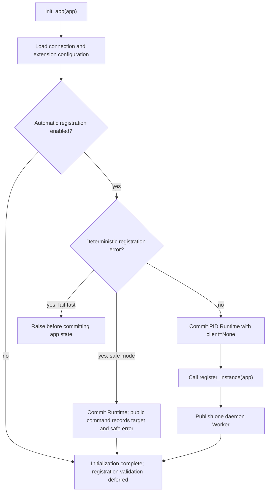
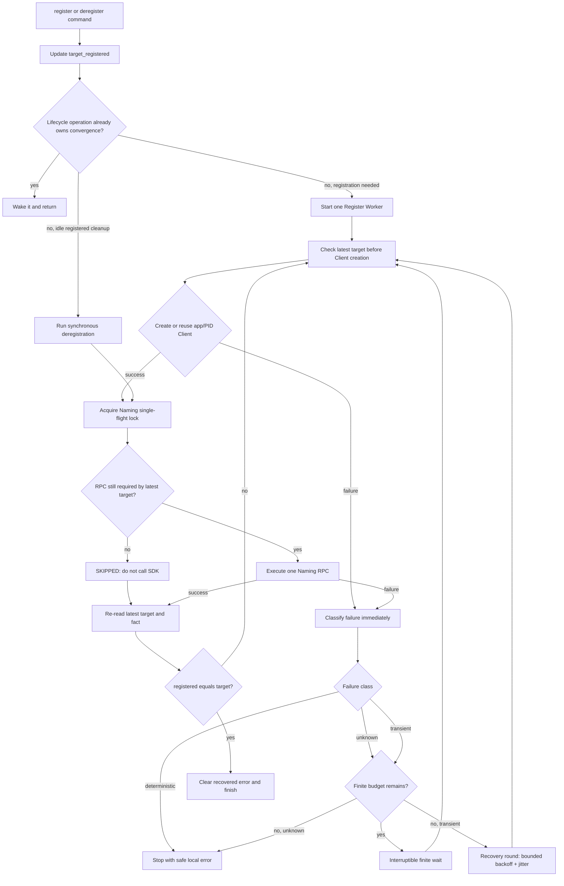

# Service Registration

English | [简体中文](service-registration.zh-CN.md)

Flask-Nacos 1.1.0 uses a target-state lifecycle. `target_registered` is the
latest requested state; `registered` is the last locally confirmed Naming
fact. One daemon convergence Worker moves the fact toward the latest target and
exits as soon as convergence completes or can no longer continue safely.

## Automatic registration

Automatic registration defaults to enabled:

```python
app.config.update(
    NACOS_AUTO_REGISTER=True,
    NACOS_SERVICE_NAME="orders-api",
    NACOS_SERVICE_PORT=5000,
)
```

When `NACOS_AUTO_REGISTER` and `NACOS_ENABLED` are true, `init_app(app)` validates the
registration snapshot and calls public `register_instance(app)`. That command
returns immediately; the Worker creates the Client and performs the Naming RPC.

With `NACOS_FAIL_FAST=True`, invalid deterministic registration configuration
raises during `init_app(app)` before extension state is committed. With false,
initialization completes with `target_registered=True`, `registered=False`, and
a safe `last_error`, without starting an invalid Worker.

When automatic registration is off, initialization does not validate
registration-only settings. The first explicit registration performs the local
deterministic validation, caches the app-state result, and then enters the same
lifecycle transition. In fail-fast mode an invalid explicit command raises
without changing the target, generation, error, operation, or Client state.

## Explicit registration

Disable initialization registration when a process should choose the lifecycle
boundary itself:

```python
app.config["NACOS_AUTO_REGISTER"] = False
nacos.init_app(app)

# Explicit app is useful outside a Flask context.
nacos.register_instance(app)

with app.app_context():
    status = nacos.get_status()
```

Repeated calls while a Worker runs do not increment the lifecycle generation or
start another Worker. After an unknown or deterministic failure leaves an unmet
target idle, a new explicit call starts a new finite attempt. A Worker already
recovering from a verified transient failure remains the single owner.

## Lifecycle flow

### Initialization



Initialization, status, health, and `.client` cache reads do not create a Nacos
Client.

### Runtime convergence



The Worker can register, retry, recover, compensate with deregistration, and
register again inside one lifecycle operation. It exits as soon as state
converges or a failure can no longer continue safely. The Nacos SDK—not this
Worker—maintains the heartbeat after successful ephemeral registration.

## Naming single-flight and three results

One app/PID Runtime executes at most one Naming register/deregister RPC at a
time. Each logical call has one of three private outcomes:

- `SUCCEEDED`: the SDK call was needed, executed, and explicitly succeeded.
- `FAILED`: the action is still needed but cannot be completed.
- `SKIPPED`: a newer target makes the call unnecessary, so the SDK is not
  called.

Retry belongs only to the Register Worker. The RPC infrastructure performs one
logical SDK call and never schedules follow-up work.

## Identity and deregistration

Successful registration atomically caches the actual service, group, cluster,
IP, and port. Every normal, compensating, or exit deregistration uses that exact
identity. If local state says registered but the cached identity is absent,
normal deregistration safely returns `False` with
`last_error="MissingRegisteredIdentity"`; it never guesses an address.

`deregister_instance(app)` returns:

- `True` for an idempotent cleanup, an accepted target change, a successful SDK
  call, or an obsolete call skipped after a newer register command.
- `False` when deregistration is still needed but fails.

## Retry, transient recovery, and target changes

Every Client or Naming failure is classified immediately from structured
evidence; exception text is never parsed:

| Failure class | Finite phase | After finite budget |
| --- | --- | --- |
| Deterministic | Stop immediately | Not applicable |
| Unknown | Existing attempt count and interval | Stop and expose safe error |
| Transient | Existing attempt count and interval | Low-frequency lifecycle recovery |

Lifecycle recovery applies only to transport failures that can be identified
reliably, such as explicit timeout/connection/network errors and selected HTTP
statuses. Each recovery round waits first, using bounded exponential backoff
with jitter. It never retries more frequently than
`max(NACOS_RETRY_INTERVAL, 1 second)`, and each failure is classified again.
`NACOS_RETRY_ENABLED=False` means exactly one current attempt and no recovery.

The retry/recovery phase belongs to the current Naming direction. Switching
between register and compensating deregister resets that direction's phase;
generation changes alone only cause re-evaluation. The Worker waits on an Event.
Register, deregister, or shutdown wakes it immediately; the Event is cleared
before waiting and state is rechecked to prevent a lost wakeup.

This is registration lifecycle transient-failure self-recovery. It applies only
to confirmed transient faults and performs no remote registration monitoring.
Explicit idle deregistration and exit deregistration remain single best-effort
calls.

The last valid lifecycle command wins. For example, register → deregister →
register ends registered when the final operation succeeds, even if an older
RPC completes after the intermediate target change.

## Ephemeral heartbeat

`NACOS_SERVICE_EPHEMERAL=True` passes
`NACOS_SERVICE_HEARTBEAT_INTERVAL` (default `5.0` seconds) to the synchronous
Nacos SDK. `healthy=True` is only initial registration input; it does not replace
heartbeat renewal. Persistent instances do not receive this heartbeat option.

## Fork and process servers

Client, Worker, locks, events, and registration facts are PID-bound. After a
fork, the parent Runtime is discarded and exactly one current-PID Runtime is
published. Ordinary business requests and SDK operations may resume pending
automatic registration. `get_status()`, `/health/nacos`, and `.client` do not.

Gunicorn `--preload` initializes the app in the master before workers fork. The
recommended configuration is `NACOS_AUTO_REGISTER=False`, followed by
an explicit `nacos.register_instance(app)` in Gunicorn's post-fork/worker-init
hook. Runtime rebuilding cannot undo a registration that the master already
started before the fork.

When multiple workers share the same service/group/cluster/IP/port, Nacos sees
one remote instance. Set `NACOS_AUTO_DEREGISTER=False` so one exiting worker does
not remove the shared endpoint, or use a single external coordinator.

## Old and new scheduling

| Dimension | Earlier scheduling | 1.1.0 scheduling |
| --- | --- | --- |
| Decision input | Current command plus delayed flags | Final target state |
| Core state | Multiple request booleans | `target_registered` and `registered` |
| Worker | Executes one register command | Continues one convergence operation |
| RPC result | Success or failure | Success, failure, or skip |
| Retry | Finite task retry could stop convergence | Register Worker owns finite retry and verified-transient recovery |
| Single-flight | Prevent duplicate register threads | All Naming RPCs |
| Client | Created during initialization | Lazy per app/PID |
| Fork | Could inherit process resources | Entire Runtime rebuilt |
| Exit | Could reuse normal deregistration | Dedicated shutdown path |

The public status exposes only stable lifecycle meaning:
`target_registered`, `registered`, `operation_running`, and `last_error`.
Internal generation, Worker ownership, pending recovery, and RPC metadata remain
private.
