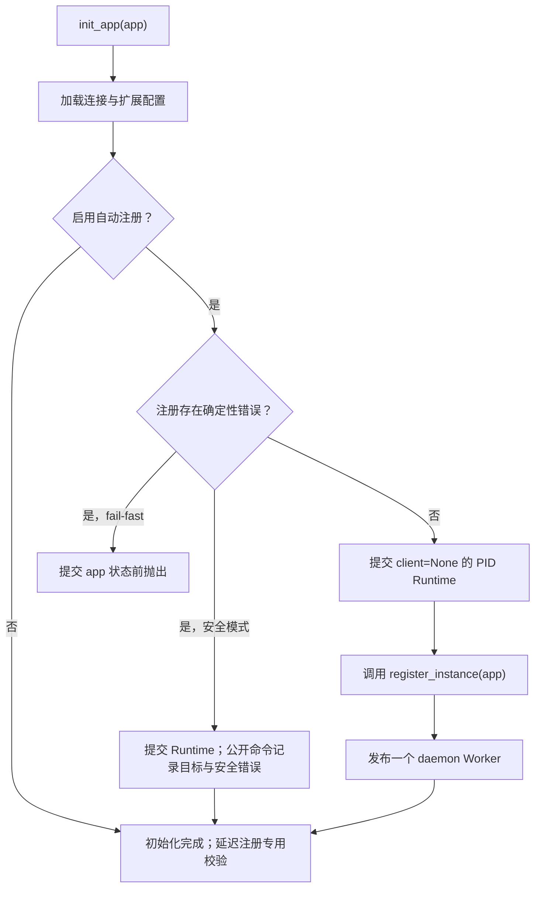
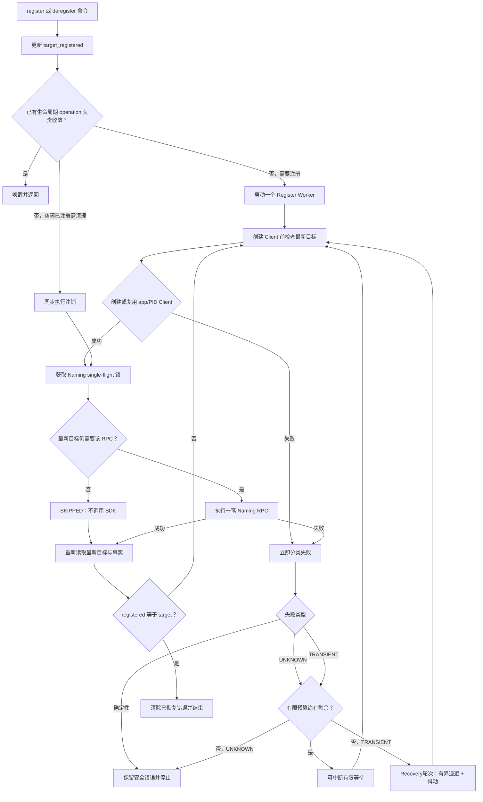

# 服务注册

[English](service-registration.md) | 简体中文

Flask-Nacos 1.1.1 使用目标状态生命周期。`target_registered` 表示最后一次请求的状态，
`registered` 表示最近一次本地确认的 Naming 事实；一个 daemon收敛 Worker负责让事实向
最新目标收敛，并在收敛完成或无法安全继续时退出。

## 自动注册

自动注册默认开启：

```python
app.config.update(
    NACOS_AUTO_REGISTER=True,
    NACOS_SERVICE_NAME="orders-api",
    NACOS_SERVICE_PORT=5000,
)
```

`NACOS_AUTO_REGISTER` 与 `NACOS_ENABLED` 都为 true 时，`init_app(app)` 校验注册快照并调用公开的
`register_instance(app)`。该命令立即返回，Client 创建与 Naming RPC由 Worker完成。

`NACOS_FAIL_FAST=True` 时，确定性注册配置非法会在 `init_app(app)` 提交扩展状态前抛出。
设为 false 时会完成初始化，状态为 `target_registered=True`、`registered=False` 和安全的
`last_error`，且不会启动无效 Worker。

关闭自动注册时，初始化不校验仅用于注册的配置。首次显式注册才执行纯本地确定性校验、
缓存当前应用状态的结果，并进入同一生命周期转换。fail-fast 模式下，非法显式命令同步
抛出，且不会修改目标、generation、错误、operation 或 Client 状态。

## 显式注册

需要由进程自行选择生命周期边界时，关闭初始化注册：

```python
app.config["NACOS_AUTO_REGISTER"] = False
nacos.init_app(app)

# Explicit app is useful outside a Flask context.
nacos.register_instance(app)

with app.app_context():
    status = nacos.get_status()
```

Worker运行中重复调用不会增加生命周期 generation，也不会启动第二个 Worker。UNKNOWN 或
确定性失败使未完成目标进入空闲后，再次显式调用会开始新的有限尝试；已经在明确瞬时故障
自恢复中的 Worker仍是唯一 owner。

## 生命周期流程

### 应用初始化



初始化、状态、健康检查与 `.client` 缓存读取都不会创建 Nacos Client。

### 运行时收敛



同一个 Worker可以在一个生命周期 operation中完成注册、有限重试、瞬时故障自恢复、补偿
注销和再次注册。状态收敛或失败无法继续安全恢复时立即退出。临时实例注册成功后的心跳由
Nacos SDK负责，而不是该 Worker。

## Naming single-flight 与三态结果

同一 app/PID Runtime 同时最多执行一笔 Naming 注册/注销 RPC。每笔逻辑调用有三种私有结果：

- `SUCCEEDED`：SDK调用仍有必要，已执行并明确成功。
- `FAILED`：动作仍有必要，但无法完成。
- `SKIPPED`：更新的目标使调用不再需要，因此不调用 SDK。

重试只属于 Register Worker。RPC基础设施每次只执行一笔逻辑 SDK调用，不调度后续工作。

## 身份与注销

注册成功时原子缓存实际服务、group、cluster、IP 和端口。普通、补偿与退出注销都使用该
准确身份。如果本地状态为已注册但身份缺失，普通注销安全返回 `False`，并设置
`last_error="MissingRegisteredIdentity"`，绝不会猜测地址。

`deregister_instance(app)` 返回：

- 幂等清理、目标变更被接受、SDK注销成功，或新的注册命令使本次注销过期时返回 `True`。
- 注销仍有必要但失败时返回 `False`。

## 重试、瞬时故障自恢复与目标变化

每次 Client 或 Naming 失败都会立即依据结构化证据分类，绝不解析异常正文：

| 失败类型 | 有限阶段 | 有限预算耗尽后 |
| --- | --- | --- |
| 确定性 | 立即停止 | 不适用 |
| UNKNOWN | 沿用现有次数与间隔 | 停止并暴露安全错误 |
| TRANSIENT | 沿用现有次数与间隔 | 进入低频生命周期自恢复 |

生命周期自恢复只适用于能够可靠确认的传输型瞬时故障，例如明确超时、连接/网络错误和选定
HTTP 状态。每轮 Recovery 都先等待，使用带抖动的有界指数退避，且不会比
`max(NACOS_RETRY_INTERVAL, 1秒)` 更频繁；每次新失败都会重新分类。
`NACOS_RETRY_ENABLED=False` 表示只执行当前一次尝试，不进入自恢复。

分类器同时覆盖惰性 Client 构造与 Naming调用，但两套基础设施仍严格分离：Client构造失败
不会发布 Naming RPC元数据，也不会伪造 Naming Outcome。SDK `2.0.11` 的精确裸
`nacos.exception.NacosRequestException` 在 `CLIENT_CREATE/register` 阶段已验证为瞬时故障；
SDK `2.0.0` Client构造和其他未经验证组合保持 UNKNOWN。结构化 401/403 认证失败属于
确定性错误并立即停止。

有限重试和 Recovery阶段属于当前实际 Naming方向。register 与补偿 deregister 之间切换时
重置方向级阶段；generation变化本身只触发重新求值。Worker使用 Event等待；注册、注销或
shutdown 会立即唤醒。等待前先清 Event，再复查状态，避免丢失并发唤醒。

这项能力是“注册生命周期瞬时故障自恢复”，只处理已确认的瞬时故障，也不监控远端注册
状态。空闲显式注销与退出注销仍只执行一笔 best-effort调用。

最后一次有效生命周期命令优先。例如 register → deregister → register 最终会在操作成功后
保持注册，即使旧 RPC在中途目标变化之后才返回。

## 临时实例心跳

`NACOS_SERVICE_EPHEMERAL=True` 时向同步 Nacos SDK传递
`NACOS_SERVICE_HEARTBEAT_INTERVAL`（默认 `5.0` 秒）。`healthy=True` 只是初始注册输入，
不能替代心跳续约。持久实例不传心跳参数。

Client wrapper 只观测这些 SDK 调用，不会成为第二个心跳 owner。有效身份按 service、group、
cluster、IP 与 port 隔离：失败按身份独立限制 WARNING，随后首次成功记录一次恢复 `INFO`。
若已验证 SDK 参数布局无法生成完整安全身份，则使用无状态 `<unknown>` 日志，不保存可能碰撞
的类型占位 key。日志保持 SDK 返回值/异常原样，也不能修改 target、事实、generation 或
Worker 状态。

## Fork 与进程服务器

Client、Worker、锁、Event 与注册事实都绑定 PID。fork 后父 Runtime整体作废，同一当前 PID
只发布一个新 Runtime。普通业务请求与 SDK操作可以恢复待执行的自动注册；`get_status()`、
`/health/nacos` 和 `.client` 不会消费 pending。

Gunicorn `--preload` 会在 worker fork 前由 master初始化应用。推荐设置
`NACOS_AUTO_REGISTER=False`，并在 Gunicorn 的 post-fork/worker-init hook中显式
调用 `nacos.register_instance(app)`。Runtime重建无法撤销 master在 fork 前已经启动的注册。

多个 worker共享相同 service/group/cluster/IP/port 时，Nacos 只看到一个远端实例。应设置
`NACOS_AUTO_DEREGISTER=False`，避免一个 worker退出时删除共享端点，或使用单一外部协调者。

## 新旧调度对照

| 维度 | 原调度 | 1.1.0 调度 |
| --- | --- | --- |
| 调度依据 | 当前命令和延迟标记 | 最终目标状态 |
| 核心状态 | 多个请求布尔值 | `target_registered` 与 `registered` |
| Worker | 执行一次 register | 持续推动一次收敛 operation |
| RPC 结果 | 成功或失败 | 成功、失败或跳过 |
| Retry | 有限任务重试可能停止收敛 | Register Worker统一负责有限重试与已确认瞬时故障自恢复 |
| Single-flight | 防重复 register 线程 | 所有 Naming RPC |
| Client | 初始化时创建 | app/PID 惰性创建 |
| Fork | 可能继承进程资源 | 整个 Runtime 重建 |
| 退出 | 可能复用普通注销 | shutdown 专用路径 |

公开状态只暴露稳定生命周期含义：`target_registered`、`registered`、
`operation_running` 和 `last_error`。内部 generation、Worker owner、pending恢复与 RPC元数据
保持私有。
