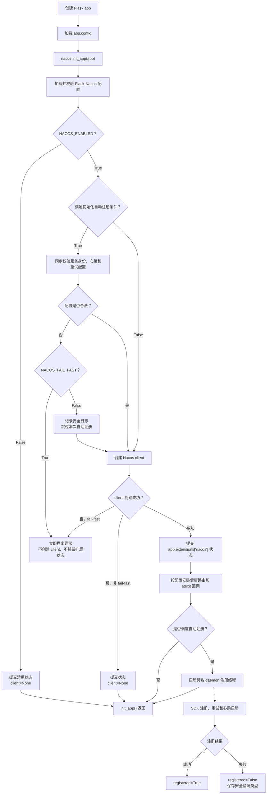
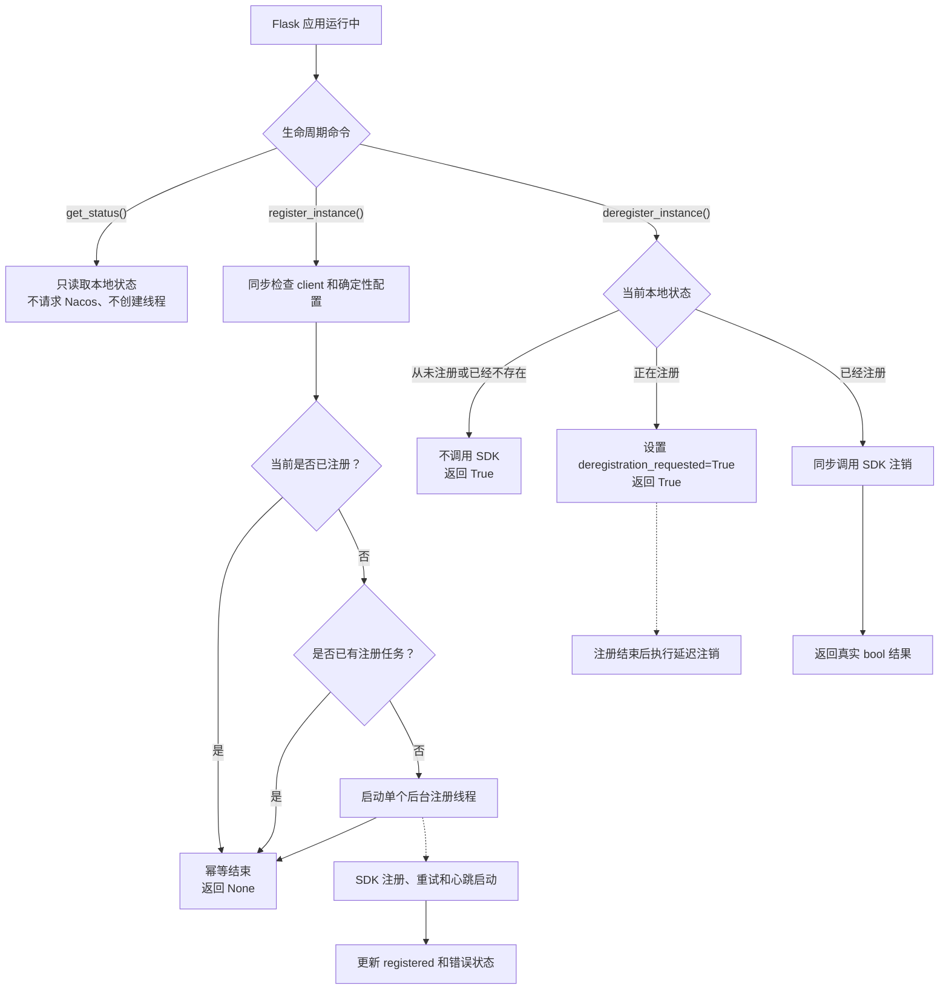

# 服务注册

[English](service-registration.md) | 简体中文

flask-nacos 如何注册与注销服务实例。

另请参阅：[配置项](configuration.zh-CN.md) - [API 参考](api-reference.zh-CN.md) -
[生产部署](production.zh-CN.md)。

## 自动注册

当 `NACOS_REGISTER_ENABLED`、`NACOS_AUTO_REGISTER` 与
`NACOS_AUTO_REGISTER_ON_INIT` 都为 `True` 时，会由 `init_app(app)` 调度后台注册。注册配置
会在创建 SDK client 和写入扩展状态前同步校验。`NACOS_FAIL_FAST=True` 时非法配置立即抛出；
关闭 fail-fast 时会记录错误并跳过自动注册，配置中心和服务发现仍可使用。

三个注册开关的默认值均为 `True`；真正注册仍要求有效的服务名与端口。

任一自动注册开关关闭时，启动阶段不要求注册配置；显式调用 `register_instance()` 时再校验。

## 显式注册

`NACOS_REGISTER_ENABLED` 只控制初始化阶段的自动注册，不会禁用显式手动调用。

```python
nacos.register_instance()
```

## 非阻塞按需注册

`register_instance()` 是用于 readiness、worker 启动后、Flask/Celery 共用工厂及其他
生命周期入口的无参数命令。它始终立即返回 `None`，并通过 daemon 线程执行注册。

```python
app.config["NACOS_AUTO_REGISTER_ON_INIT"] = False
nacos.register_instance()
status = nacos.get_status()
```

通过 `registered`、`registration_in_progress` 和 `last_registration_error_type` 查看后台结果。

## 注册生命周期流程图

### 应用初始化



### 运行时注册与注销



注册与注销竞争遵循“最后一次明确操作优先”。`get_status()` 是命令/查询生命周期中的查询
接口，始终不执行 SDK I/O。

## 注册参数

注册前会校验以下参数；非法值遵循 `NACOS_FAIL_FAST` 规则：

- `NACOS_SERVICE_NAME` —— 必填，必须是非空且不能只包含空白字符的字符串。
- `NACOS_SERVICE_PORT` —— 必填，`1-65535` 范围内的整数。
- `NACOS_SERVICE_WEIGHT` —— 大于 `0` 的有限数字。
- `NACOS_SERVICE_METADATA` —— 必须是 `dict`。
- `NACOS_SERVICE_EPHEMERAL` —— 必须是 `bool`。
- `NACOS_SERVICE_HEARTBEAT_INTERVAL` —— 大于 `0` 的有限数字，单位为秒。

## 临时实例心跳

临时实例依靠 SDK 心跳保持健康。注册临时实例时，Flask-Nacos 会把
`NACOS_SERVICE_HEARTBEAT_INTERVAL` 传给 SDK 2.x，默认值为 `5.0` 秒。初始的
`healthy=True` 只描述注册时的状态，不能替代持续心跳。

持久实例不会收到心跳间隔参数。如果临时实例先出现健康实例数为 0、随后又消失，请检查
心跳日志、`NACOS_SERVICE_EPHEMERAL`、namespace/group 是否一致，以及 Flask 进程是否
仍在运行。`/health/nacos` 仅反映本地 client 初始化状态，不能证明 Nacos 在持续收到心跳。

## IP 自动识别

若未设置 `NACOS_SERVICE_IP`，扩展会尝试识别本机出口 IP。识别失败时，行为遵循
`NACOS_FAIL_FAST`。

生产建议：显式配置 `NACOS_SERVICE_IP`。在容器、多网卡主机或 NAT 环境下，自动识别到
的地址可能无法被其他服务访问。同时请显式设置 `NACOS_SERVICE_NAME` 与
`NACOS_SERVICE_PORT`。

## 幂等 single-flight 注册

注册始终按 app、按进程 single-flight，并在成功后保持幂等。当 fork 出新 worker
（进程 ID 变化）时，会重置继承的本地状态，子进程可注册自己的实例。

## 多进程注册（Gunicorn / uWSGI）

在 Gunicorn / uWSGI 下，主进程会 fork 多个 worker，每个 worker 都会执行 `init_app`
并维护本进程的注册状态。但 Nacos 使用 service/group/cluster/IP/port 标识实例，因此公布
相同 IP 和端口的 worker 对应同一个共享实例，而不是每个 worker 一个实例。

对于共享端点，请设置 `NACOS_DEREGISTER_ON_EXIT=False`，避免单个 worker 退出时在其他
worker 仍提供服务的情况下删除实例；或者由单一外部协调者负责注册与注销。部署建议见
[生产部署](production.zh-CN.md)。

校验保证发生在 `FlaskNacos(app)` 或 `init_app(app)` 实际执行时。延迟加载的 WSGI 服务器
可能直到第一次请求才创建应用；如果非法配置必须在接收流量前阻止进程启动，请使用 eager
load/preload。

## 注销

```python
nacos.deregister_instance()
```

注销是幂等的。本地实例不存在时不调用 SDK 并返回 `True`；注册中返回 `True` 表示延迟
注销已接受，可通过 `deregistration_requested` 查看等待状态。

## 自动注销

当 `NACOS_AUTO_DEREGISTER` 与 `NACOS_DEREGISTER_ON_EXIT` 都为 `True` 时，会通过
`atexit` 处理器会等待正在执行的注册操作，再注销由当前扩展成功注册的实例；从未注册或
注册失败时不执行注销。每个 app 状态最多注册一次该处理器。
